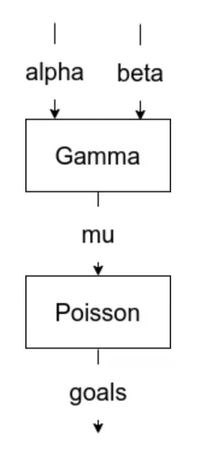
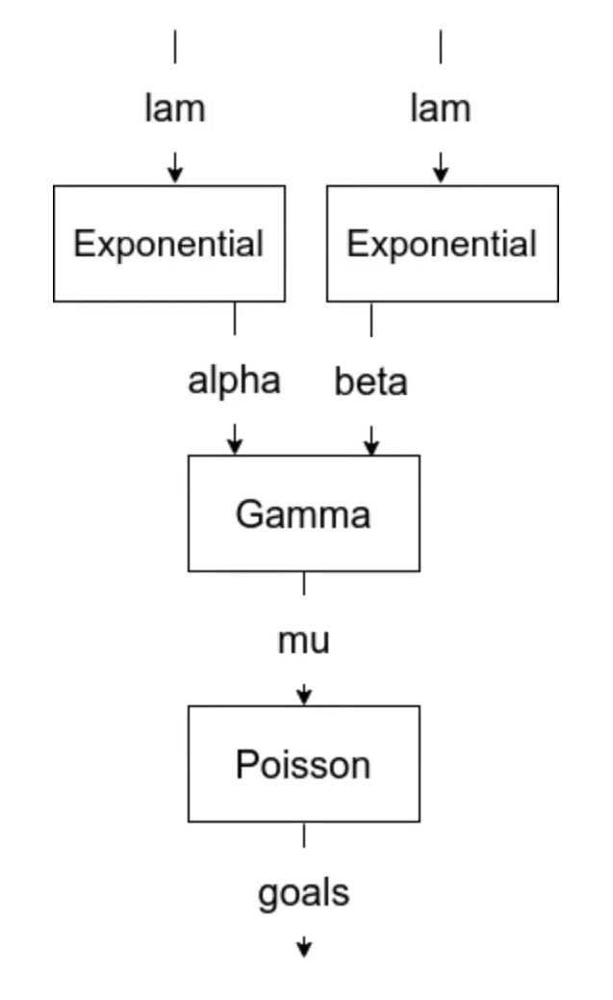
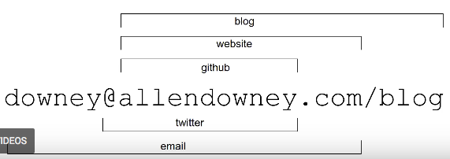

**Useful reference for distributions:**

[https://distribution-explorer.github.io/](https://distribution-explorer.github.io/) 

## **Learning Bayesian Statistics With Pokemon GO by Tushar Chandra**

- Useful first pass overview of two simple models developed and explored in PyMC3. Tushar approaches problems using the following framework:
    1. Describe the data generating process
    2. "Sketch" out the model conceptually with Distributions etc...
    3. Fill in the gaps
    4. Sample 
    5. Iterate

    - Tushar frames the problem well and outlines with two separate models how to:
        - Identify the 'rate' of an underlying phenomenon. In this case it's the occurrence of shiny versions of different Pokemon. Beta distributions are useful for rates / probabilities / things between 0 and 1.
        - Identify if there is an underlying change in a timeseries. For example, a change in the rate at which a particular pokemon hatches. In our case, we might be able to use this as an alternative A/B test method when we don't have any controls.

Resources

- Talk: [https://discourse.pymc.io/t/learning-bayesian-statistics-with-pokemon-go-by-tushar-chandra/6020](https://discourse.pymc.io/t/learning-bayesian-statistics-with-pokemon-go-by-tushar-chandra/6020)
- Repo: [https://github.com/tuchandra](https://github.com/tuchandra)

## The Bayesian Zig Zag: Developing and Testing PyMC Models by Allen Downey

- An interesting perspective that uses the conceptual framework of modeling forwards and backwards.
- Modeling forwards → designing an empty model and sampling from it to get an idea of what things might look like without your data.
- Modeling backwards ← using the data to shape your priors to get a posterior. Allen suggests moving back and forth between the two and iterating to develop things further.
- Main example includes predicting the outcome of hockey games using historical scores.
- This leverages the **Poisson Process (discrete)** which is great for sporting events**.**
    - Poisson process
        - *How long will it be until the next event occurs (goal)*
        - *How many events in a given interval?*
- Allen also gives good examples of using priors for your priors etc...E.g. using a gamma distribution to parameterise the distribution of the poisson.
- Because in this example we've got conjugate priors, you can calculate things analytically even though he's choosing not to.
- Allen also addresses **Hierarchical Approaches.**

**Original approach - two inputs.** 

**Secondary hierarchical approach.** 

Resources

- Talk: [https://discourse.pymc.io/t/the-bayesian-zig-zag-developing-and-testing-pymc-models-by-allen-downey/5978](https://discourse.pymc.io/t/the-bayesian-zig-zag-developing-and-testing-pymc-models-by-allen-downey/5978)
- See Allen's [book](http://thinkbayes.com/) for more.
- [New book](https://github.com/AllenDowney/ThinkBayes2)
- Allen also has a fun way of sharing his contact details: 

    

## The Bayesian Workflow: Building a COVID-19 Model by Thomas Wiecki

- Does what it says on the tin and models the spread of COVID-19. Does so however with a very particular set of assumptions that are quite stringent to begin with.
    - E.g. Covid rate only increases (this eventually gets relaxed).
- Still easy to follow and very systematic. Useful example of how real world assumptions map to model specification.
- Thomas is good at critiquing the method and iterating on it. E.g. demonstrating the impact of poorly chosen priors.
- He's a good example of the use of predictive checks - both prior and posterior.
    - Prior = sampling values from prior and generating data
    - Posterior = sampling values from posterior and generating data (what the model thinks the data looks like after having seen the data).
- Demonstrates the issues of poor model specification and how this prevents correct sampling in the search space. Normally, **it's you**, not the sampler that's gone wrong.
- Also uses **validation / test set concept** to test the model which many bayesian examples don't.
- Also does **model comparison** which is interesting.

Second half focuses on the notion of **Generative** models. I.e. where future predictions incorporate previous ones (historical random parameters are used to create future estimates in a time-varying way). Also addresses time varying, variability e.g. R number of Covid. 

Also includes the notions of Lag due to delay in cases through incubation and testing lags etc.

Resources:

- [Talk](https://discourse.pymc.io/t/the-bayesian-workflow-building-a-covid-19-model-by-thomas-wiecki/6017)

## Using Hierarchical Multinomial Regression to Predict Elections in Paris at the District-Level by Alex Andorra

- Unusual for a tutorial because of target being **Multinomial.** Most Bayes examples don't do this and focus on more simple targets.
- Excessive data preparation in the talk. Spends the first 25 minutes talking about cleaning and setting up. Lots of unusual cases in the data which make this complicated. If you have a very complicated hierarchical need then this might serve as a useful template etc.
- Uses an interesting *coords* construct to parameterise the PyMC model which I haven't seen before.
- Good focus in the talk on **Prior Predictive Checks**. For more information see [here](https://docs.pymc.io/notebooks/posterior_predictive.html). Same as Thomas Wiecki above. 
- Intense talk. Probably needs a couple of hours afterwards to break down each step in more detail.
- Best thing to do is go through the Jupyter notebook which seems helpful.

Resources

- [Talk](https://discourse.pymc.io/t/using-hierarchical-multinomial-regression-to-predict-elections-in-paris-at-the-district-level-by-alex-andorra/6057)

## Hierarchical Time Series With Prophet and PyMC3 by Matthijs Brouns

- Great overview of Bayesian approaches relative to classic ARIMA stuff. Explains {prophet} at the beginning too and discusses package {timeseers} which he has developed. 
- Usefully relates to issues of missing data, mixed up time series, outliers etc. E.g. time series like reach / activations or similar.
- Downsides of {prophet} - doesn't let you modify the parameterization of the model. Can't use multiple series easily.
- Re-builds {prophet} in PyMC3. Does so by breaking down each of the steps.
    - Linear growth. > Seasonality > Stochasticity > Error
        - Seed space with evenly distributed change points
        - Location isn't learned. Delta at change points is learned.
        - Uses strong regularisation prior - e.g. laplacian.
        - Get growth rate at time T using creation of smooth function.
        - See [http://prophet.mbrouns.com/](http://prophet.mbrouns.com/)

Really well explained! And reccomend watching to anyone. 

Resources

- [Talk](https://discourse.pymc.io/t/hierarchical-time-series-with-prophet-and-pymc3-by-matthijs-brouns/5988)

## Bayesian Machine Learning: A PyMC-Centric Introduction by Quan Nguyen

- Starts with a basic introduction into gaussian processes and random parameters.
- Then moves onto the comparison of typical linear regression with Bayesian linear regression.
- Didn't resonate with me but examples are still clear.
- Outlines approaches to a range of modeling techniques using conceptual examples

Resources

- [Talk](https://discourse.pymc.io/t/bayesian-machine-learning-a-pymc-centric-introduction-by-quan-nguyen/5985/1)