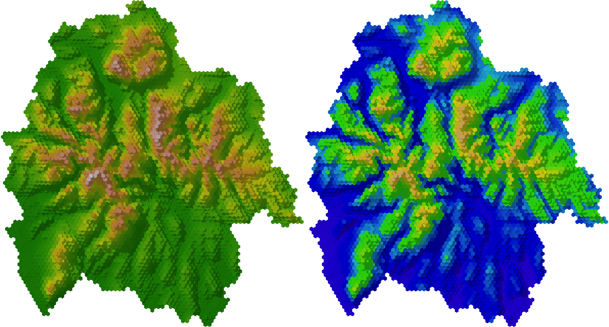
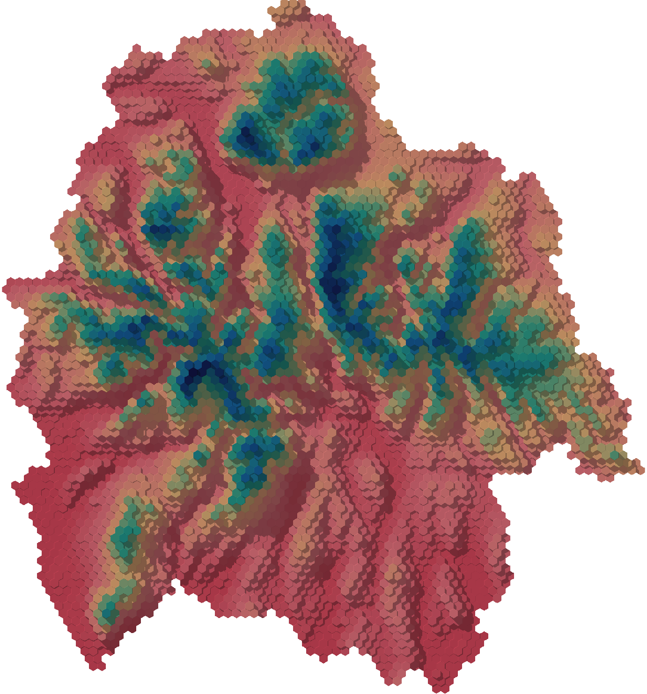
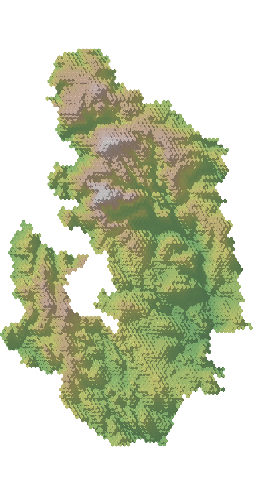
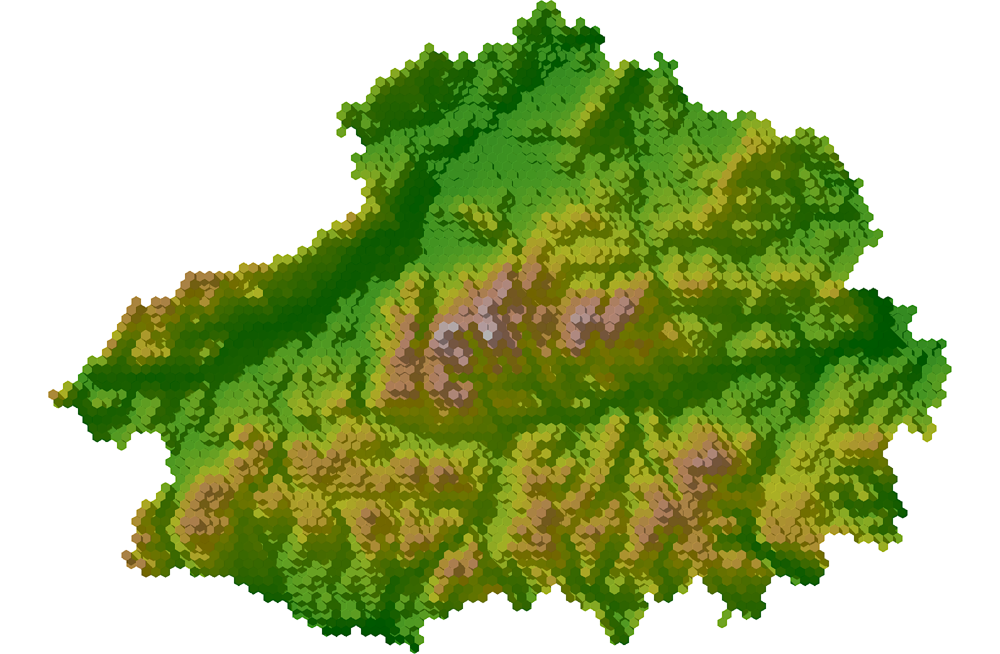

I recently saw that Sean Conway had been creating some really nice hexbinned renders of [Ireland](https://twitter.com/geo_spatialist/status/1310943883191296000). I wanted to see if I could do the same thing but entirely in R.  

I set myself a challenge of seeing if it was possible to make some of these within 40 minutes. As you can see I threw the kitchen sink at it when it comes to libraries. Fortunately because of the fantastic R community the below had me up and running quite quickly. 

```R
library(LaCroixColoR)
library(sp)
library(sf)
library(elevatr)
library(hexbin)
library(dplyr)
library(MapPalettes)
library(velox)
library(fasterize)
library(stars)
library(rayshader)

df1 <- st_read("your_geospatial_vectors_here")
df <-  as(df1, "Spatial")
elevation <- get_elev_raster(df, z = 10)
elevation_mask <- raster::mask(elevation, df)
hexbins <- hexbin_raster(elevation_mask, n=5000, function(x) mean(x, na.rm = TRUE))
hexbins.st <- st_rasterize(hexbins["stat"], dx = 20, dy = 20)
elmat = as.matrix(hexbins.st$stat)

elmat %>%
  height_shade(texture = "#aee8e6") %>%
  add_shadow(ray_shade(elmat, zscale=2, sunaltitude=25, sunangle=315), 0.3) %>%
  plot_map()
```
I should really turn this into a much less hacky reusable function and i'm sure that I could speed it up. Despite that, i'm glad it worked. Have a look below for some of the different places that I mapped. 

The first render that I created used the Lake District National Boundary and I played with a few different colour options. I prefer the lighter colour palettes as they help to identify the shadows more effectively. 



Even though I say that, I also had a look at some more atypical colour scales which was quite fun. 



So I also had a go at doing the Peak District with a little less saturation and the Cairngorms with a little more! 





I plan on doing some more soon and pushing this a bit further. 


