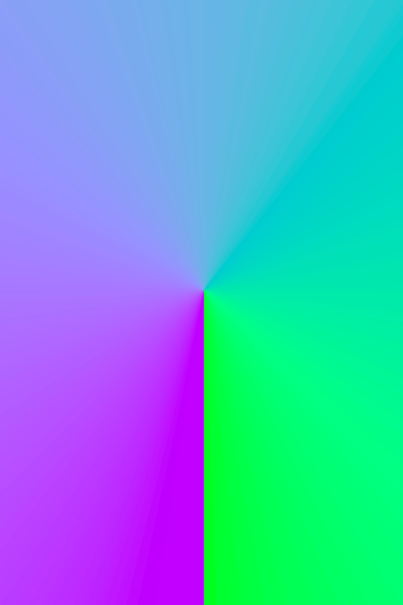
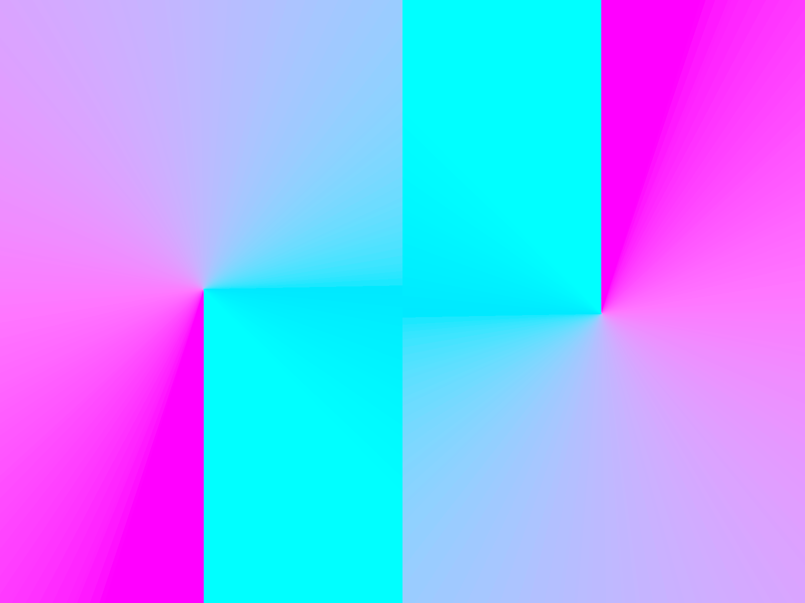
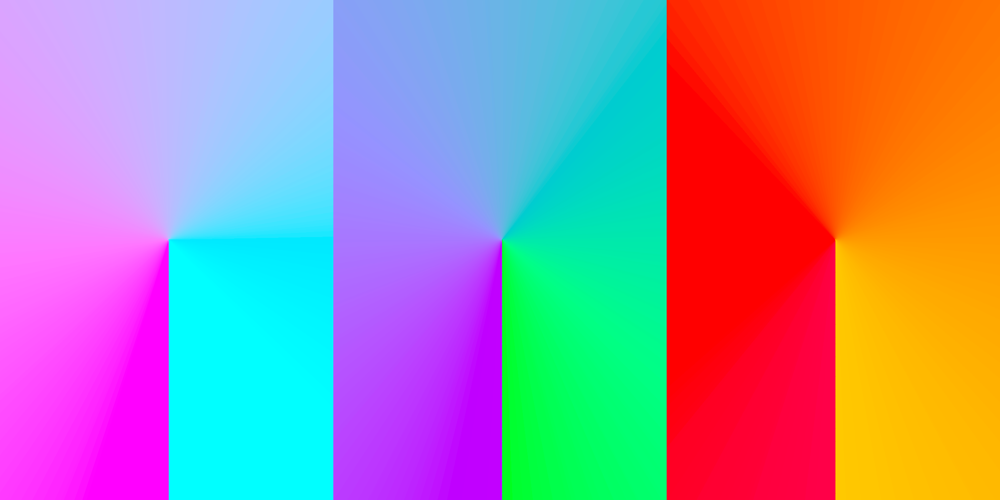
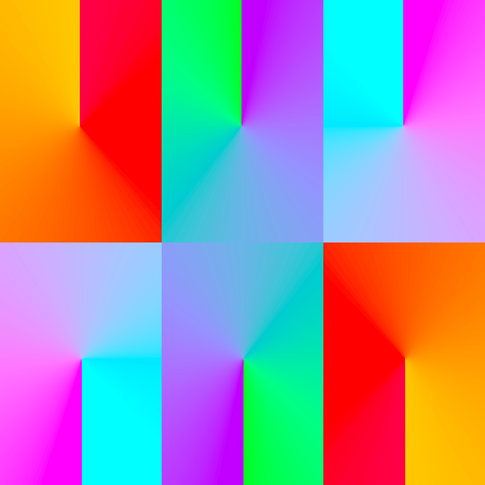

In the same vein as a previous post, I've been inspired by [Vans Design](vansdesign.net) to recreate some gradient images. They're very simple, and satisfyingly elegant. On this occasion, I considrered a number of ways to realise the images but I ended up going with the use of polar coordinates made available in `{ggplot2}`. I also used `{magick}` to help with some image stitching, cropping and combining. 

There's a small bug in the code which is realised in the final image and the eagle eyed among you may have noticed it right away. In some ways, it's visually uncomfortable but in others I like the juxtaposition between what seems to be perfectly smooth and symmetrical, when in fact, it's not quite.

I started out with individual images:

Then I combined some:

Finally, I decided to see what all of them combined would look like. Not bad but more could be done. 

Nonetheless, it was a fun experiment!

