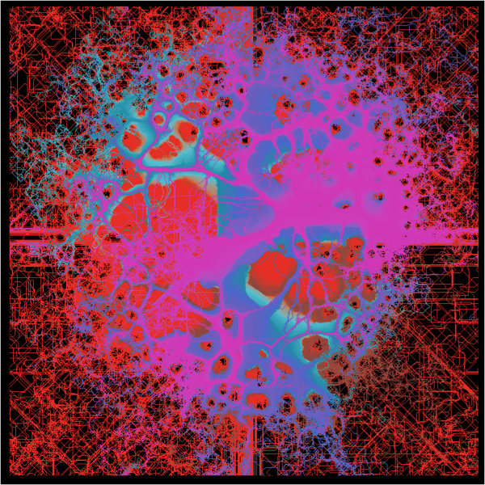
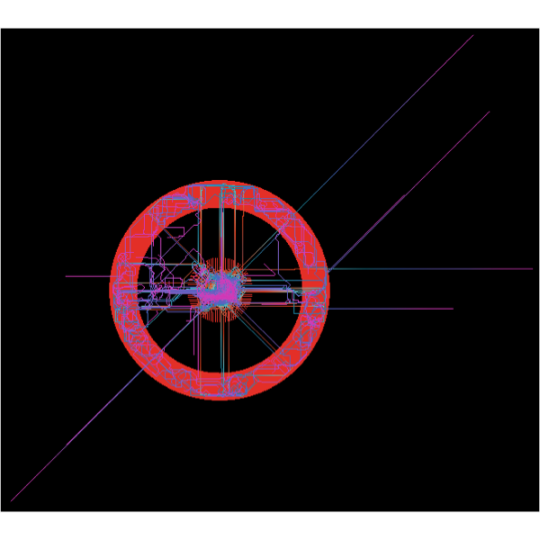
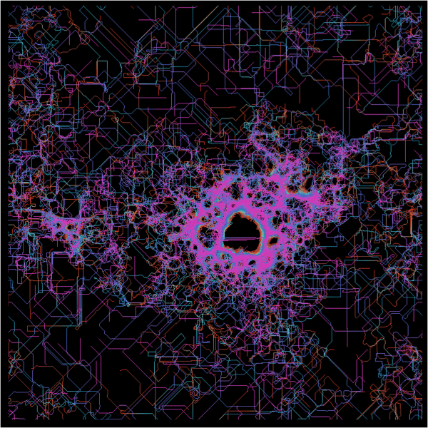

There's a lot of great work being done in the R community that enables us to create generative art and in the last 18 months or so, the amount of code available has exploded. With thanks to individuals such as:

- [Thomas Pedersen](https://www.data-imaginist.com/about)
- [Will Chase](https://www.williamrchase.com/)
- [Antonio Sánchez Chinchón](https://fronkonstin.com/)
- [Danielle Navarro](djnavarro.net) 

It's possible for any beginner to adapt existing generative systems and create their own art. To date, i've been working on my own system, but progress has been slow. In the meantime, I like playing around with different parameterisations of systems created by some of the great producers above. 

For this post, i've been experimenting with combining the Physarum model kindly created and made available by [Antonio Sánchez Chinchón](https://fronkonstin.com/) with the color paletts created by [Vans Design](vansdesign.net). 

Here's a few examples of different parameterisations with different colour palettes from [Vans Design](vansdesign.net).

