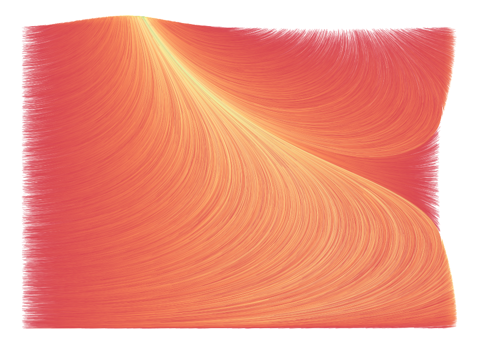
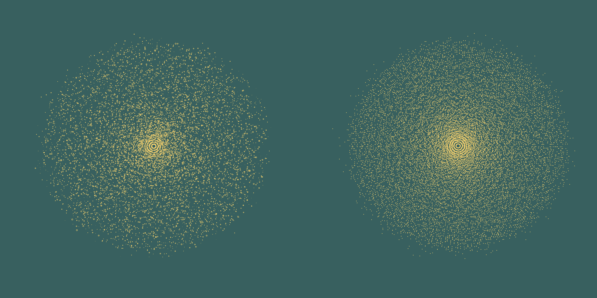
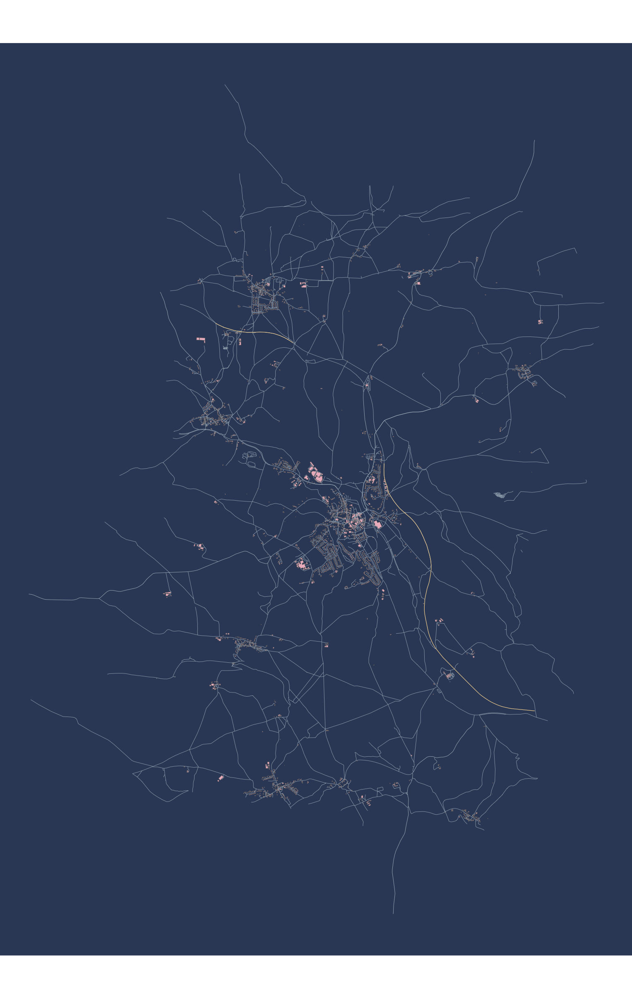
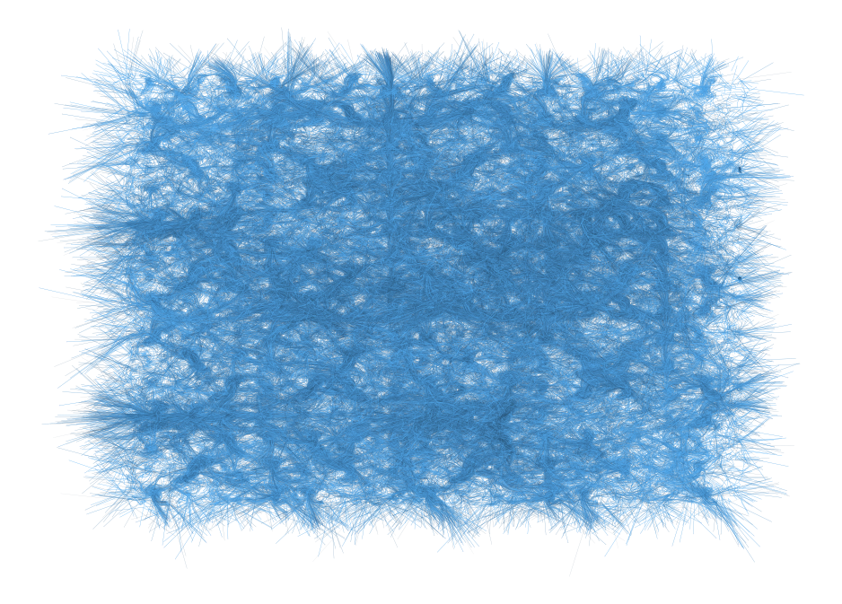
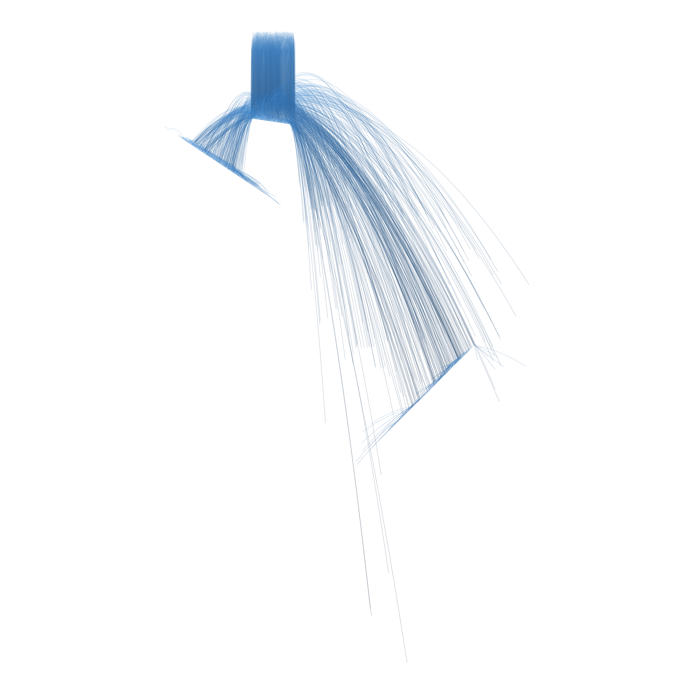

I've recently been creating random bits of generative art. I often forget to save the code and lose the images. This post is simply a placeholder of some of the imagery that's emerged from my explorations.

### Simulation with particles & D3Force

Sand dune or Donald Trump?

Trees or Stars?

Where's this?

Hairball!

Falling particles or Cousin it?

